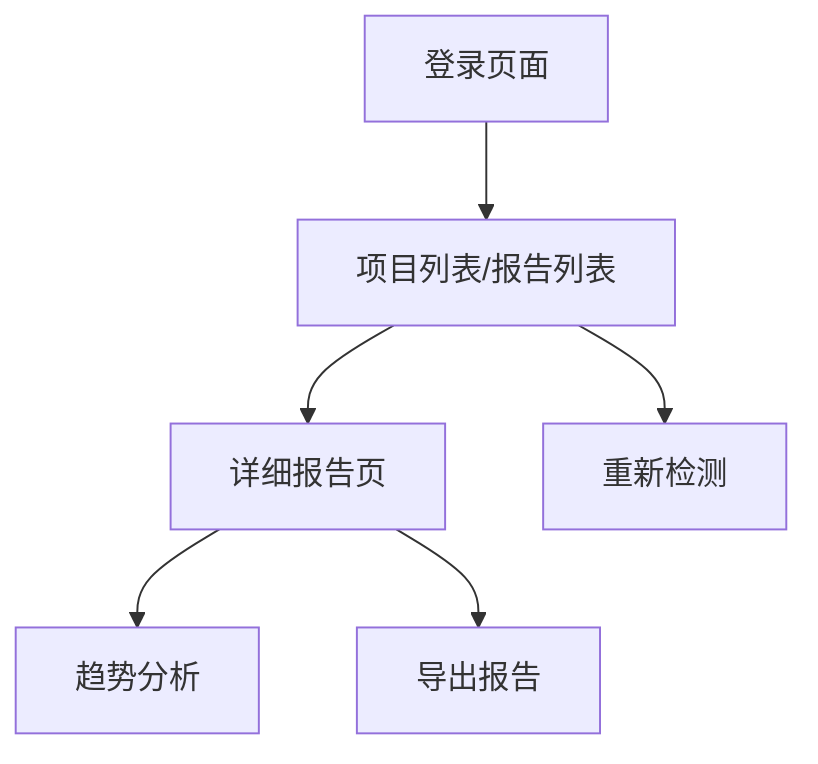

## 1. 产品概述
自动性能监控检测平台，帮助开发者在部署完成后一键检测多个页面的性能指标。支持登录状态页面的性能检测，提供详细的性能报告和优化建议。

目标用户为前端开发者、测试工程师和运维人员，帮助他们快速发现性能瓶颈，提升用户体验。

## 2. 核心功能

### 2.1 用户角色
| 角色 | 注册方式 | 核心权限 |
|------|----------|----------|
| 普通用户 | 邮箱注册 | 创建/管理项目、执行检测任务、查看基础报告 |
| 高级用户 | 管理员分配 | 批量检测、API调用、高级分析报告 |

### 2.2 功能模块
平台包含以下主要页面：
1. **项目管理页**：创建和管理检测项目，保存项目配置和页面列表。
2. **任务创建页**：基于项目快速启动检测，或创建临时检测任务。
3. **检测执行页**：实时显示检测进度、中断检测操作。
4. **报告列表页**：展示历史检测记录、快速筛选和搜索。
5. **详细报告页**：显示完整性能指标、优化建议、对比分析。

### 2.3 页面详情
| 页面名称 | 模块名称 | 功能描述 |
|-----------|-------------|-------------|
| 项目管理页 | 项目列表 | 展示所有已保存的项目，支持增删改查 |
| 项目管理页 | 项目配置 | 设置项目名称、默认检测配置（设备/网络）、登录信息 |
| 项目管理页 | 页面管理 | 维护该项目需要检测的页面列表（URL列表） |
| 任务创建页 | 快速启动 | 选择已有项目，一键启动检测任务 |
| 任务创建页 | 临时检测 | 输入待检测网址、配置参数，执行一次性检测 |
| 检测执行页 | 进度监控 | 实时显示每个页面的检测状态、剩余时间 |
| 检测执行页 | 操作控制 | 暂停、继续、取消检测任务 |
| 检测执行页 | 实时日志 | 显示检测过程中的详细日志信息 |
| 报告列表页 | 记录展示 | 列表显示所有检测任务，包含时间、状态、页面数量 |
| 报告列表页 | 搜索筛选 | 按项目、时间范围、状态筛选检测记录 |
| 报告列表页 | 快速操作 | 重新检测、删除记录、导出报告 |
| 详细报告页 | 性能概览 | 显示Lighthouse核心指标（FCP、LCP、CLS、FID、TTI） |
| 详细报告页 | 详细指标 | 展示完整的性能数据、资源加载时间、截图对比 |
| 详细报告页 | 优化建议 | 基于检测结果提供具体的优化方案 |
| 详细报告页 | 历史对比 | 与该项目历史检测数据进行趋势分析 |

## 3. 核心流程

### 项目检测流程
1. 用户登录系统，进入项目管理页
2. 创建新项目，填写项目名称、描述
3. 配置项目的检测参数（设备、网络、登录信息）
4. 添加需要检测的页面URL列表并保存
5. 点击“运行检测”，系统自动基于项目配置创建检测任务
6. 在检测执行页面实时监控进度
7. 检测完成后，查看详细报告，数据自动归档到该项目下

### 历史记录查看流程

## 4. 用户界面设计

### 4.1 设计风格
- **主色调**：深蓝色（#1890ff）搭配白色背景
- **按钮样式**：圆角矩形，主要操作为实心按钮，次要操作为线框按钮
- **字体**：系统默认字体，标题16px，正文14px
- **布局风格**：卡片式布局，左侧导航，右侧内容区域
- **图标风格**：使用Ant Design图标库，线性图标为主

### 4.2 页面设计概览
| 页面名称 | 模块名称 | UI元素 |
|-----------|-------------|-------------|
| 项目列表 | 项目卡片 | 展示项目名称、上次检测时间、平均分数、操作按钮（编辑/运行） |
| 项目详情 | URL管理 | 列表展示URL，支持批量添加、导入、拖拽排序 |
| 检测执行页 | 进度监控 | 进度条配合百分比显示，每个页面独立显示状态 |
| 报告列表页 | 记录展示 | 表格形式展示，包含项目名称、状态图标、时间 |
| 详细报告页 | 性能概览 | 仪表盘样式展示核心指标，趋势图展示历史变化 |

### 4.3 响应式设计
采用桌面端优先设计，适配1200px以上屏幕。移动端通过响应式布局适配，主要功能在移动端可用，但推荐使用桌面端获得最佳体验。

## 5. 性能要求
- 支持同时检测最多50个页面
- 单个页面检测超时时间：60秒
- 报告生成时间：检测完成后5秒内
- 系统并发处理能力：支持10个用户同时创建检测任务
