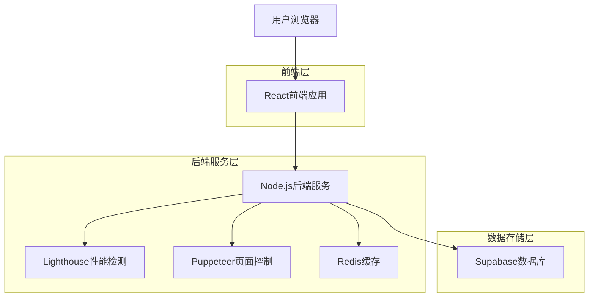
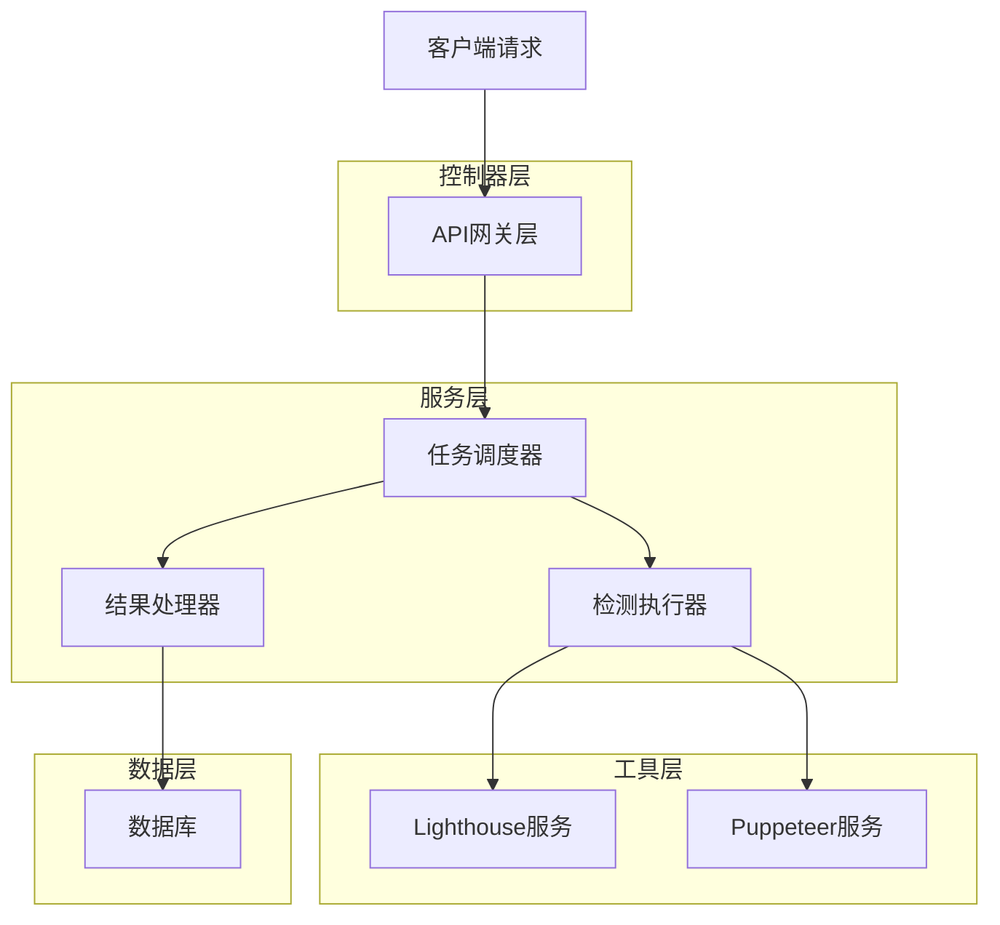
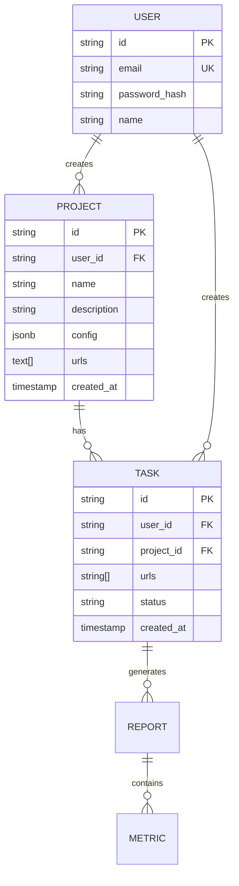

## 1. 架构设计



## 2. 技术描述

- **前端**: React@18 + TypeScript + Ant Design + Vite
- **初始化工具**: vite-init
- **后端**: Node.js@18 + Express@4
- **数据库**: Supabase (PostgreSQL)
- **缓存**: Redis
- **性能检测**: Lighthouse + Puppeteer

## 3. 路由定义

| 路由 | 用途 |
|-------|---------|
| / | 首页，展示平台介绍和快速入口 |
| /login | 登录页面，用户身份验证 |
| /dashboard | 仪表板，显示概览信息和快捷操作 |
| /projects | 项目列表，管理检测项目 |
| /projects/:id | 项目详情，编辑配置和页面列表 |
| /task/create | 任务创建页面，配置检测参数 |
| /task/:id | 任务执行页面，显示实时进度 |
| /reports | 报告列表页面，历史记录管理 |
| /report/:id | 详细报告页面，展示检测结果 |
| /profile | 用户配置页面，个人信息设置 |

## 4. API定义

### 4.1 项目管理API

#### 创建项目
```
POST /api/projects
```
请求参数：
| 参数名 | 参数类型 | 是否必需 | 描述 |
|-----------|-------------|-------------|-------------|
| name | string | 是 | 项目名称 |
| description | string | 否 | 项目描述 |
| config | object | 是 | 默认检测配置（device, network, auth） |
| urls | string[] | 是 | 页面URL列表 |

#### 获取项目列表
```
GET /api/projects
```

#### 获取项目详情
```
GET /api/projects/:id
```

### 4.2 任务API

#### 创建检测任务
```
POST /api/tasks/create
```

请求参数：
| 参数名 | 参数类型 | 是否必需 | 描述 |
|-----------|-------------|-------------|-------------|
| projectId | string | 否 | 关联的项目ID（如果是基于项目运行） |
| urls | string[] | 是 | 待检测的网址列表（如有projectId可覆盖） |
| device | string | 是 | 设备类型（desktop/mobile） |
| network | string | 是 | 网络环境（slow3g/fast4g/wifi） |
| authType | string | 否 | 认证类型（form/token） |
| authData | object | 否 | 认证数据 |

#### 获取任务状态
```
GET /api/tasks/:id/status
```

#### 获取检测报告
```
GET /api/reports/:id
```

## 5. 服务器架构图



## 6. 数据模型

### 6.1 数据模型定义



### 6.2 数据定义语言

#### 用户表（users）
```sql
CREATE TABLE users (
    id UUID PRIMARY KEY DEFAULT gen_random_uuid(),
    email VARCHAR(255) UNIQUE NOT NULL,
    password_hash VARCHAR(255) NOT NULL,
    name VARCHAR(100) NOT NULL,
    role VARCHAR(20) DEFAULT 'user' CHECK (role IN ('user', 'admin')),
    created_at TIMESTAMP WITH TIME ZONE DEFAULT NOW()
);
```

#### 项目表（projects）
```sql
CREATE TABLE projects (
    id UUID PRIMARY KEY DEFAULT gen_random_uuid(),
    user_id UUID REFERENCES users(id) ON DELETE CASCADE,
    name VARCHAR(100) NOT NULL,
    description TEXT,
    default_config JSONB DEFAULT '{}'::jsonb,
    urls TEXT[] DEFAULT '{}',
    created_at TIMESTAMP WITH TIME ZONE DEFAULT NOW(),
    updated_at TIMESTAMP WITH TIME ZONE DEFAULT NOW()
);

CREATE INDEX idx_projects_user_id ON projects(user_id);
```

#### 任务表（tasks）
```sql
CREATE TABLE tasks (
    id UUID PRIMARY KEY DEFAULT gen_random_uuid(),
    user_id UUID REFERENCES users(id) ON DELETE CASCADE,
    project_id UUID REFERENCES projects(id) ON DELETE SET NULL,
    urls TEXT[] NOT NULL,
    device VARCHAR(20) NOT NULL,
    network VARCHAR(20) NOT NULL,
    auth_type VARCHAR(20),
    auth_data JSONB,
    status VARCHAR(20) DEFAULT 'pending',
    progress INTEGER DEFAULT 0,
    created_at TIMESTAMP WITH TIME ZONE DEFAULT NOW(),
    started_at TIMESTAMP WITH TIME ZONE,
    completed_at TIMESTAMP WITH TIME ZONE
);
```

#### 报告表（reports）
```sql
CREATE TABLE reports (
    id UUID PRIMARY KEY DEFAULT gen_random_uuid(),
    task_id UUID REFERENCES tasks(id) ON DELETE CASCADE,
    url VARCHAR(500) NOT NULL,
    lighthouse_data JSONB NOT NULL,
    performance_score INTEGER,
    status VARCHAR(20) DEFAULT 'pending',
    error_message TEXT,
    screenshot TEXT,
    created_at TIMESTAMP WITH TIME ZONE DEFAULT NOW()
);
```

## 7. 性能检测服务设计
（同上版本）

## 8. 部署架构与推荐平台

由于后端需要运行完整的浏览器环境（Chromium）和性能密集型任务，这对**免费部署平台**提出了巨大挑战（主要是内存限制）。

### 8.1 核心挑战：内存
- **Lighthouse/Puppeteer**：通常至少需要 1GB RAM 才能稳定运行，建议 2GB+。
- **大多数免费 PaaS**（如 Render Free, Koyeb Free）：通常限制在 512MB RAM。这会导致浏览器进程崩溃（OOM）。

### 8.2 推荐方案：Google Cloud Run (最佳平衡) <mcreference link="https://cloudchipr.com/blog/cloud-run-pricing" index="1">1</mcreference> <mcreference link="https://cloud.google.com/run/pricing" index="4">4</mcreference>

这是目前**最可行且可能“免费”**的方案，适合低频使用的工具类应用。

*   **类型**：Serverless 容器 (Serverless Container)。
*   **为什么推荐**：
    *   **按量付费**：只有在运行检测任务时才收费。如果您的平台每天只跑几次任务，费用极低甚至为 0。
    *   **高性能**：您可以配置 **2GB 或 4GB 内存**的实例，这完美解决了 Puppeteer 的内存需求。
    *   **免费额度**：每月前 200 万次请求免费，有一定的免费 CPU/内存时间额度。对于个人或小团队项目，通常都在免费额度内。
*   **部署方式**：构建 Docker 镜像并推送到 Google Container Registry，然后部署到 Cloud Run。

### 8.3 备选方案

#### 方案 B: Render / Railway (付费试用或低成本)
*   **Render**：免费层只有 512MB RAM，**极大概率无法运行**本项目。付费 $7/月起。
*   **Railway**：提供 $5 试用金，之后按量付费。部署体验极佳，但不是永久免费。

#### 方案 C: Oracle Cloud Always Free (硬核免费)
*   **资源**：提供高达 4核 CPU / 24GB RAM 的 ARM 服务器（Ampere）。
*   **优点**：资源极其慷慨，完全免费。
*   **缺点**：
    *   **注册难**：Oracle 的注册风控很严，很多用户无法注册成功。
    *   **架构兼容性**：服务器是 ARM 架构 (aarch64)，需要确保 Docker 镜像构建时支持 ARM (Chromium 有 ARM 版本，但配置稍麻烦)。

### 8.4 总结建议

| 平台 | 免费程度 | 适用性 | 备注 |
|------|----------|--------|------|
| **Google Cloud Run** | **高 (按量)** | **⭐⭐⭐⭐⭐** | **首选**。内存够大(可配4GB)，低频使用几乎不花钱。 |
| **Oracle Cloud** | 完全免费 | ⭐⭐⭐ | 资源最强，但注册困难，ARM 架构需适配。 |
| **Railway** | 试用金 | ⭐⭐⭐⭐ | 体验最好，但用完即止。 |
| **Render Free** | 完全免费 | ⭐ | 内存太小 (512MB)，基本不可用。 |

**最终建议**：
后端采用 **Google Cloud Run** 部署，前端采用 **Vercel** 部署。这是兼顾性能、成本和可行性的最佳组合。
